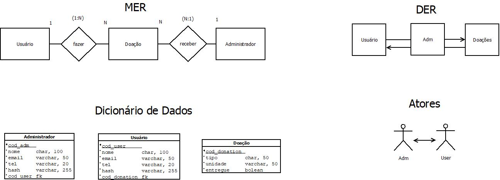

 
# Fácil Solidário 


<br>

# 🔎 Sobre o Projeto
Fácil solidário é um trabalho de conclusão de curso desenvolvido na ETEC Professor Adhemar Batista Heméritas. 

Este projeto tem como objetivo facilitar a doação de alimentos em instituições já existentes. Mantendo o sub-tema do trabalho sobre "Proteção de dados", utilizamos bibliotecas como: Bcrypt, CSRUF, Helmet, Validator e DotEnv para assegurar a integridade do usuário. Com auxilio da API SendGrid, esta aplicação consta com cadastro de duas etapas e um validador de senha, que contém uma criptografia com HASH antes de entrar no banco de dados.

Para melhor controle e manipulação dos dados armazenados, o sistema consta também com um serviço administrativo, o qual com um acesso especial - alterado e enviado diariamente para o E-mail da [solidariofacil@gmail.com](solidariofacil@gmail.com) - é possível confirmar a entrega da doação cadastrada.

<br>
<br>

# 💾 Diagrama do Banco de Dados



<br>
<br>

# 👥 Responsáveis


- [Victor Hugo](https://github.com/victorfreire7) (Back-End completo do projeto, criação banco de dados SQL, integração com API, Design UI/UX do projeto, Criação do logotipo)
- [Isabella Cardoso](https://github.com/isacardosods) (Monografia completa do projeto, JavaScript Front-End do projeto, idealização banco de dados SQL, Design UI/UX do projeto)
- [Pietro Sousa](https://github.com/pietrooliveira17) (JavaScript Front-End do projeto, implementação da acessibilidade com SCSS, auxílio no Back-End)
- [Ryan Santos](https://github.com/darkboat4) (Front-End completo do projeto, HTML e CSS do projeto, auxílio no gerenciamento do projeto)
- [Mariana Mota](https://github.com/10121974) (Design UI/UX, desenvolvimento da campanha do projeto, desenvolvimento de imagens, conteúdo textual)
- [Marcus Alberes](https://github.com/YoniAlice) (Formatação em ABNT na monografia, auxílio na abstração do banco de dados SQL, desenvolvimento de imagens, conteúdo textual, conteúdo textual)

<br>
<br>

# 💻 Modo de iniciação:

- Após criar um clone deste repositório, dentro da pasta do mesmo, criar um arquivo '[.env](https://www.npmjs.com/package/dotenv)'.


- Dentro do arquivo '.env' setar as seguintes variáveis: 

``` .env
    DB_NAME=
    DB_USER=
    DB_PASSWORD=
    DB_PORT=
    DB_HOST=
    SESSION_SECRET=
    SENDGRID_API_KEY=
```

- Sendo "SENDGRID_API_KEY=" a chave da API para envio de emails. para mais informações, [Leia sobre aqui](https://www.twilio.com/docs/sendgrid/for-developers/sending-email/quickstart-nodejs).

-  Após a criação do arquivo, atribuir as variáveis de acordo com os respectivos: Nome, Usuário, Senha, Porta e Host do seu banco de dados MySQL. O banco de dados pode ser criado usando [MySQL Workbench 8.0 CE](https://dev.mysql.com/downloads/workbench/). -  Não se esqueça de ativar o seu banco de dados usando um Serviço semelhante ao Wamp ou UsbWebServer para ativar a sua port 3306 e, assim, relizar a conexão com ssua base de dados -.

- Em seguida, criar um Schema no seu banco de dados nomeado com o "DB_NAME=" setado anteriomente.

- Ao terminar de configurar o seu Banco de Dados, abrir o Terminal do seu clone deste repositório e digitar as seguintes informações:

``` bash
npm i
```

``` bash
npm run dev
```

- Feito isso, a aplicação estará rodando no seu [localhost:3030](http://localhost:3030).

<br>
<br>

# 🔒 Dependências:
``` JSON
    "dependencies": {
        "bcryptjs": "^3.0.2",
        "body-parser": "^2.2.0",
        "connect-flash": "^0.1.1",
        "cookie-parser": "^1.4.7",
        "csurf": "^1.2.2",
        "dotenv": "^16.5.0",
        "ejs": "^3.1.10",
        "express": "^5.1.0",
        "express-session": "^1.18.1",
        "helmet": "^8.1.0",
        "mysql2": "^3.14.1",
        "sequelize": "^6.37.7",
        "validator": "^13.15.0"
    },
    "devDependencies": {
        "@sendgrid/mail": "^8.1.5",
        "nodemon": "^3.1.10",
        "random-string-generator": "^1.0.7"
    }
```
